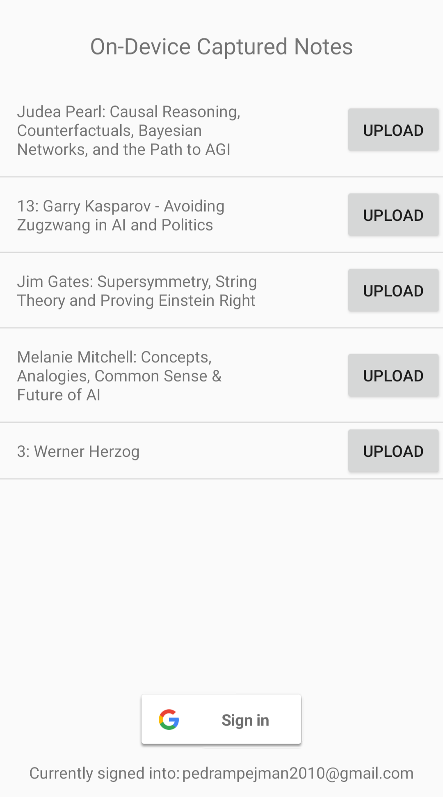

# Notey

Do you go on long runs but hate running?

Do you listen to podcasts to make it suck less?

Do you want to note down interesting points the speakers make, but can't while running 5 MPH?

Do you wish you could somehow tap your smart watch when you hear an interesting point, and it figures out what to take notes of? 

Well then A) you should probably consider getting out of the bay area and go make some normal friends.. 

but in the meanwhile B) ..... then Notey is for you!

With a single tap on any Wear OS watch, you can let Notey know that you have found the discussion in the preceeding moments of your Spotify podcast interesting.

Notey will keep record of all these markers and after you're done listening to the episode (and hopefully your workout), it will start crunching through the data.

Notey uses your Spotify account to re-listen to the neighborhoods in which the markers were dropped, and using Natural Language Understanding and Automatic Speech Recognition techniques, it will do its best to note down the excerpt of the discussion of interest.

You can then correct its mistakes and provide it with valuable feedback on what you were actually interested in.
Over time, it should get smarter :)

## Usage

The Wear OS app is very simple - it shows you what you're listening to right now, and allows you to let Notey know you want to take note of what was just discussed.


After installing the Android companion app, you'll log into both your Google account (to access Google Docs) and Spotify. You will use the app to upload the notes that Notey has taken for you to a Google Doc.



## Design

* Wear OS App - Main UI; keeps connection to SpotifyClient when on; enables user to start session and drop marker.
* Android App - Provides SpotifyClient to devices in the mesh; Fulfills /spotify/marker/add and /spotify/session/{start|end} intents; After session end, downloads from Spotify and uploads fixed-length window of audio around each marker to Notey Cloud for processing;
* Notey Cloud - Orchestrates all ASR and NLU as soon as an entire session is uploaded; input: [FixedLengthAudio] -> output: [int offset: Conversation]; Uploads the output to a Google Doc, emailed to the user; Registers a listener on the Doc for future changes
* TFX Pipeline - ExampleGen seeds from changes ingested from Docs listeners (what happens when changes are outside of anything in the window?); Transform builds the applied and correct input token masks; Trainer: ASR model is off-the-shelf so we only have to apply updates to the NLU model -- TBD; TF Serving will host both models

## Milestones

* User can tap the Wear OS App, and have the Android App capture Spotify's current playback position.
* User can start session, end is inferred, and Android app records session markers in Notey Cloud db.
* User authenticates Android with Google Apps, and Notey Cloud uses the creds to send email with session marker times.
* After session is done, Android starts background process that retrieve FixedLengthAudio for each marker when user is not using Spotify.
* Android uploads FixedLengthAudio objects to Notey Cloud persistent storage and Notey Cloud calls off-the-self model on TF Serving to perform ASR.
* Notey Cloud uses pre-trained NLU model to perform the masking task. The result is uploaded to a Google Doc.
* A TFX pipeline is deployed composed of ExampleGen, Transform, Trainer and TF Serving on Kubeflow.
* A garbage collectible listener is registered with the Google Doc and its output is picked up by a TFX ExampleGen, which kicks off a retraining workflow.

## Testing

To start adb's daemon on device

```
adb devices
adb -s $DEVICE_ID tcpip 5555
```

To connect to a (remote) device
```
adb connect $DEVICE_IP
```
